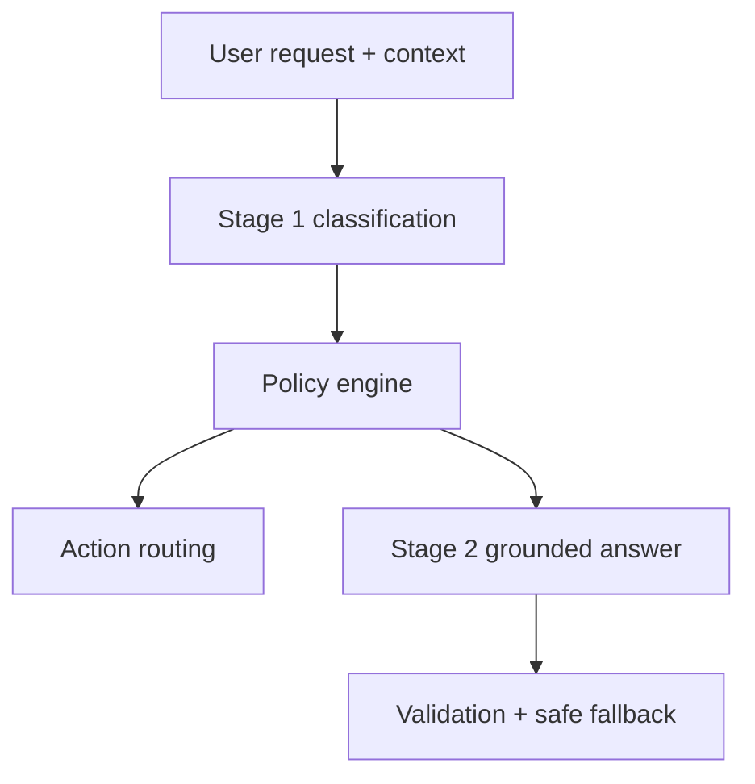
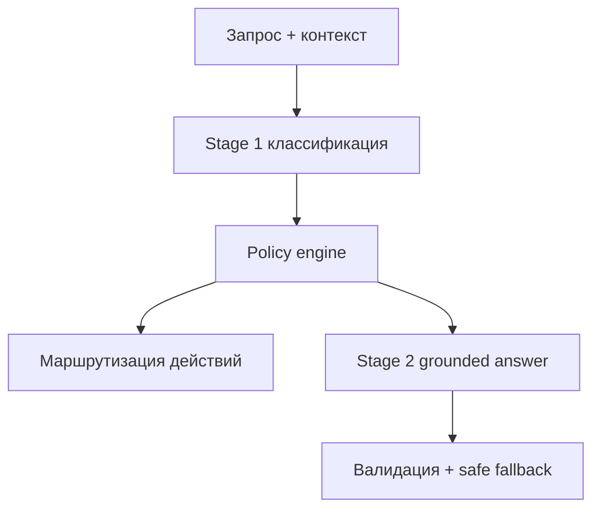

# secure-rag-actions-engine

## English
## Problem
RAG systems in production need deterministic safety controls and action governance, not only free-form LLM responses.
## Solution
This project provides a secure 2-stage RAG orchestration blueprint with policy-driven action routing, validation, and safe fallback handling.
## Tech Stack
- Python
- Pydantic
- pytest
- Structured policy/action orchestration
## Architecture
```text
src/secure_rag_engine/
tests/
pyproject.toml
```

## Features
- Two-stage RAG control flow
- Deterministic action policy (`escalate/create_ticket/notify_admin/none`)
- Injection hardening and trust boundaries
- Validation retries and fallback response
- Dispatcher interfaces for action backends
## How to Run
```bash
pip install -e .[dev]
pytest
```

## Русский
## Проблема
Продакшен RAG-системам нужны детерминированные механизмы безопасности и маршрутизации действий, а не только свободный ответ LLM.
## Решение
Проект предоставляет безопасный 2-stage RAG blueprint с policy-driven маршрутизацией действий, валидацией и fallback-логикой.
## Стек
- Python
- Pydantic
- pytest
- Оркестрация policy/action
## Архитектура
```text
src/secure_rag_engine/
tests/
pyproject.toml
```

## Возможности
- Двухэтапный RAG-пайплайн
- Детерминированная policy маршрутизации действий
- Защита от prompt injection
- Повторы валидации и безопасный fallback
- Интерфейсы dispatch для action backend
## Как запустить
```bash
pip install -e .[dev]
pytest
```
